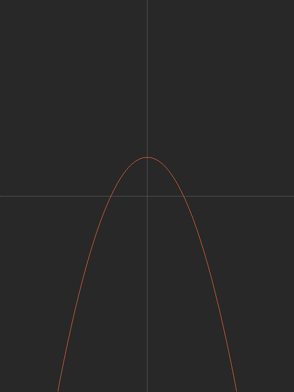

### Plotter

Pixel by pixel xy 2d function plot generation C.


##### Usage

All variables that are meant to be changed by the user are in config.h

```
./build.sh && ./a.out
```

Outputs a ppm image.
You can use tools like ImageMagick to convert it to png (highly recommended since ppm has absolutely no compression)
ex.

```
convert test.ppm test.png
```

#### Examples
```
f(x) -(x*x)/70 + 80
```
</img>
```
f(x) = cos(x/25)*100
```
</img>
