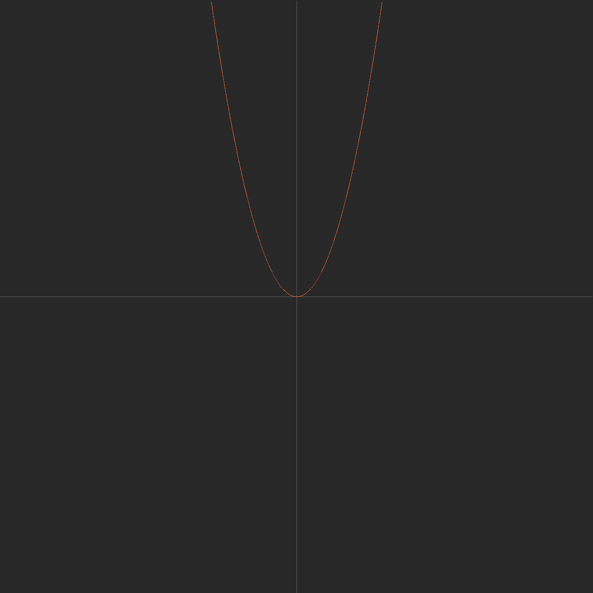
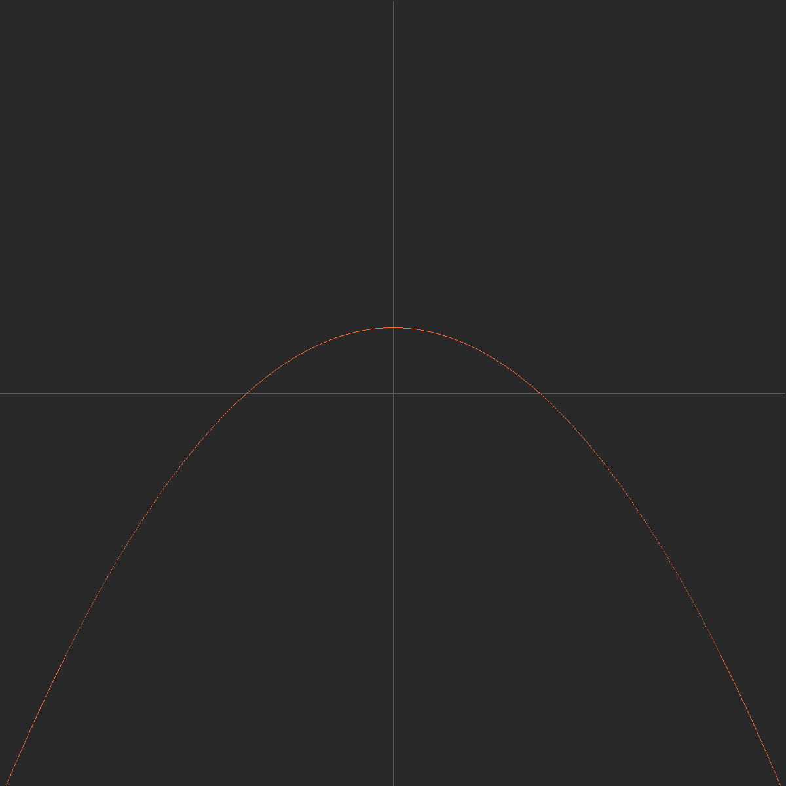

### Plotter

Pixel by pixel xy plot generator in C.


It currently can

- generate a line from a to b

- fill

- generate a parabola


##### Usage

```
./build.sh && ./a.out
```

Outputs a ppm image.
You can use tools like ImageMagick to convert it to png (highly recommended since ppm has absolutely no compression)
ex.

```
convert test.ppm test.png
```

##### Example output

</img>
</img>
